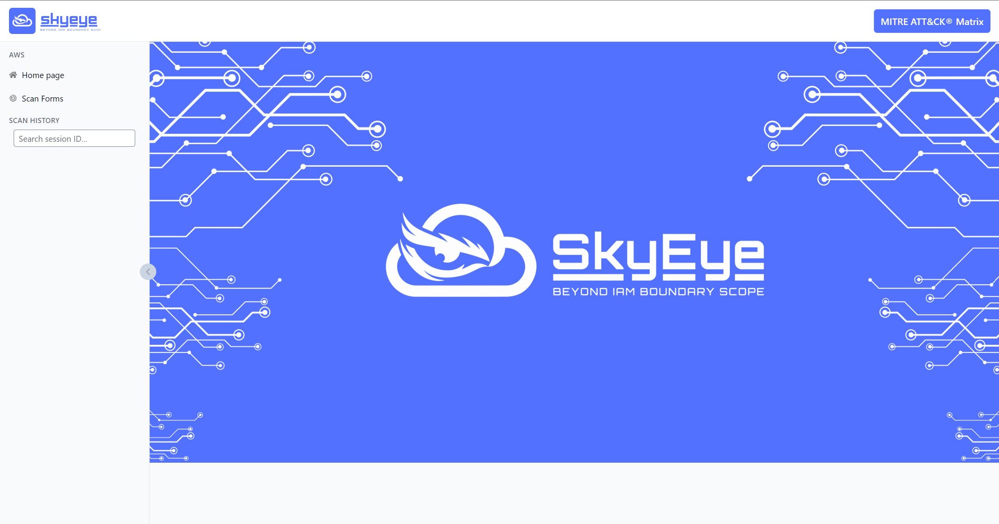

# SkyEye: When your vision reaches beyond IAM boundary scope

**SkyEye** is a cutting-edge IAM Enumeration Framework for Amazon Web Service (AWS).

The original idea of SkyEye came from the difficulty occurring with single-principal or separate-principal IAM enumeration approach. In the enumeration phase of penetration testing process, penetration testers often gather multiple AWS credentials in the format: AccessKey, SecretKey, Session Token. But it could only perform separate-principal or single-principal IAM enumeration from each user session, leading to false negatives due to limitation of principal-specific IAM entitlement vision. To resolve this limitation, SkyEye - `Cross-Principal IAM Enumeration Model (CPIEM)` was proposed and developed to efficiently perform advanced IAM enumeration across multiple user principal within the AWS Account Id, to complement each user's IAM vision context. By coordinating available sessions of each valid credential simultaneously, it can:
* Discover hidden permissions
* Reveal a more accurate and complete IAM policy landscape for each IAM entity
* Minimize false negatives that typically occur with single-principal IAM enumeration

Instead of depending on the self-access IAM entitlement visibility of single user to reveal its IAM context, and to fully understand what permissions and what resources that the user is allowed to perform and interact with, sometimes leading to false negatives when user could perform some specific permissions to specific resources but could not have the situational awareness on that, the cross-principal IAM enumeration model which is the core capability of SkyEye framework is designed to tackle this limitation by involving and correlating simultaneously multiple valid credentials to continually expose the complete IAM visibility of each user principal.

Last but not least, one of core model which differs SkyEye from other prior-art models and frameworks is SkyEye - `Transitive Role Enumeration Model (TREM)`.
Each "user" principal might have the permission to assume some specific roles and retrieve the temporary session tokens to act on behalf of those roles. Each "role" principal might also have the permission to assume the other roles, and to act on behalf of those roles through temporary session tokens.

The term In-scope IAM Roles in `Transitive Role Enumeration Model (TREM)` is defined by:
* The roles that can be assumed **directly** by provided AWS credentials:
    * User A → Role A
    * User A → Role B
* The roles that can be assumed **indirectly** by the roles that can be assumed by provided AWS credentials:
    * User A → Role A
        * Role A → Role E
            * Role E → Role F
                * Role F → Role I
        * Role A → Role G
            * Role G → Role H
    * User A → Role B
> In-Scope IAM Roles: Role A, Role B, Role E, Role F, Role I, Role G, Role H

`Transitive Role Enumeration Model (TREM)` is proposed and developed with the capability of gathering in-scope IAM roles, performing the transitive role assumption to act on behalf of in-scope IAM roles, and simultaneously complementing to the entire scanning output, subsequently contributing to the reduction of false negatives, and improving the overall accuracy of the IAMs output. Each role is an independent principal with associated permissions assigned to, which can be leveraged in complementing to the overall enumeration of IAM users, groups, roles, policies that having a strong bond to the targeting AWS credentials. Currently, TREM has been integrated into the 3 main enumeration capabilities: Cross-Principal, Separate-Principal, Single-Principal.

Currently, SkyEye supports the following enumeration models and capabilities:

1. Cross-Principal IAM Enumeration Model (CPIEM)
2. Separate-Principal IAM Enumeration Model (SePIEM)
3. Single-Principal IAM Enumeration Model (SiPIEM)
    * Integrating with Permissions Simulation Capability
    * Integrating with Fuzzing Capability
4. Transitive Role Enumeration Model (TREM)
5. IAM Deep Enumeration Capabilities:
    * a.    Retrieval of In-Scope IAM Groups and In-Scope IAM Roles for User Principals
    * b.	Retrieval of Inline Policies for User Principals
    * c.	Retrieval of Attached Managed Policies for User Principals
    * d.	Retrieval of Inline Policies for In-Scope IAM Groups
    * e.	Retrieval of Attached Managed Policies for In-Scope IAM Groups
    * f.	Retrieval of Inline Policies for In-Scope IAM Roles
    * g.	Retrieval of Attached Managed Policies for In-Scope IAM Roles
    * h.	Retrieval of Comprehensive IAM Result with `iam:GetAccountAuthorizationDetails`
    * i.	Inverse Approach for Attach Managed Policy Enumeration with `iam:ListEntitiesForPolicy`
    * j.	Deep Comparison Model for Policy Documents of Active Version and Historical Versions
6. The Integration of MITRE ATT&CK Cloud in SkyEye Framework
---

## 📚 Table of Contents

- [Key Features](#-key-features)
- [Demo](#-demo)
- [Quick Start $Docker Compose$](#-quick-start-docker-compose)
- [Install Locally $Dev Mode$](#-install-locally-dev-mode)
- [Configuration](#-configuration)
- [API Reference $FastAPI$](#-api-reference-fastapi)
- [Using Skyeye](#-using-skyeye)
- [License](#-license)

## 🖼️ Demo



## ✨ Key Features

| Feature                                      | Description                                                                                                                               |
| -------------------------------------------- | ----------------------------------------------------------------------------------------------------------------------------------------- |
| **Cross‑Principal Mode**                        | One of the core model of SkyEye which supports enumerating and correlating simultaneously multiple valid AWS credentials to continually expose the complete IAM visibility of each user principal, significantly reducing overall false negatives.                                        |
| **Separate‑Principal Mode**                        | Sub-core model of SkyEye which only supports enumerating IAMs of multiple valid AWS credentials separately                                        |
| **Single‑Principal Mode**                        | Sub-core model of SkyEye which only supports enumerating IAM of single valid AWS credentials. Fuzzing capability and permissions simulation capability are integrated in Single-Principal mode only, to avoid a huge amount of time due to the large number of AWS actions.                                       |
| **Fuzzing Capability and Permissions Simulation**                                  | Optional IAM Fuzzing Capability and Permissions Simulation Capability for Single-Principal IAM Enumeration                                                                                  |
| **Historical Policy Versions Comparison**                      | The Deep Comparison between current active version and other versions for identified Customer-Managed Policies.                                                   |
| **Severity mapping and MITRE ATT&CK Matrix** | Map discovered actions for each credential to severity, vulnerabilities, abuse methodology, Tactics/Techniques/Sub-techniques from the MITRE ATT&CK Matrix - Cloud |
| **Progress & Logs**                          | Real‑time progress bar and server‑sent logs so you always know what the scanner is doing.                                                 |
| **Portable Output**                          | Outputs JSON files that can be archived or piped into other tools.                                                                |

## 📦 Quick Start (Docker Compose)

```bash
# 1. Clone the repo
$ git clone https://github.com/0x7a6b4c/skyeye.git && cd skyeye

# 2. Build and run both services
$ docker‑compose up --build

# 3. Open the app
Frontend  → http://localhost:3000
Backend UI → http://localhost:8000/docs
```

Behind the scenes Compose spins up two containers:

| Container           | Port  | Purpose                      |
| ------------------- | ----- | ---------------------------- |
| **skyeye‑backend**  |  8000 | FastAPI API (scan engine)    |
| **skyeye‑frontend** |  3000 | Next.js UI (tree visualiser) |

Environment variable `NEXT_PUBLIC_API_BASE_URL` (already set in _docker‑compose.yml_) tells the frontend where to find the API.

## 🛠️ Install Locally (Dev Mode)

```bash
# Backend
python3 -m venv .venv && source .venv/bin/activate
pip install -r requirements.txt
uvicorn api:app --reload  # http://localhost:8000

# Frontend
cd skyeye‑frontend
npm install
npm run dev               # http://localhost:3000
```

## ⚙️ Configuration

| Variable                   | Default                 | Description                                     |
| -------------------------- | ----------------------- | ----------------------------------------------- |
| `THREADS`                  |  `20`                   | Number of parallel AWS SDK calls per credential |
| `NEXT_PUBLIC_API_BASE_URL` | `http://localhost:8000` | Frontend → Backend URL                          |

All config can be set via `.env` or the container `environment:` block.

## 📑 API Reference (FastAPI)

| Method   | Path                                               | Purpose / Notes                                                                                                                                   |
| -------- | -------------------------------------------------- | ------------------------------------------------------------------------------------------------------------------------------------------------- |
| **POST** | `/scan`                                            | Start a new scan.<br>**Body**:<br>`{ credentials: [ … ], mode: "cross‑entity" \| "separate‑entity", thread: int, fuzz: bool }` → `{ session_id }` |
| **GET**  | `/sessions`                                        | Return a folder‑style tree (dates → sessions) used by the history sidebar.                                                                        |
| **GET**  | `/sessions/{session_id}`                           | JSON summary of accounts → credentials for a scan.                                                                                                |
| **GET**  | `/sessions/{session_id}/status`                    | `running` \| `fuzzing` \| `completed` \| `failed`.                                                                                                |
| **GET**  | `/sessions/{session_id}/logs`                      | **Server‑Sent Events** stream of live scan logs.                                                                                                  |
| **GET**  | `/sessions/{session_id}/{account_id}/{access_key}` | Raw JSON for a single credential set.<br>Optional query `mode=scan` or `mode=fuzz`.                                                               |
| **POST** | `/update`                                          | Kick off a data update (MITRE ATT\&CK Cloud, AWS actions, and AWS-managed policies).<br>**Body**:<br>`{ types: ["mitre-attack-cloud", "aws-actions", "aws-managed-policies"], thread: int }` → `{ update_id }` |
| **GET**  | `/update/{update_id}/status`                       | `running` \| `completed` \| `failed`.                                                                                                             |
| **GET**  | `/update/{update_id}/logs`                         | **Server‑Sent Events** stream of update job logs.                                                                                                 |

Open **`/docs`** (Swagger UI) or **`/redoc`** for interactive documentation generated automatically by FastAPI.

## 🖥️ SkyEye Quick Tutorial

1. Provide Access-Key + Secret-Key + (Optional) Session Token + Region for AWS credentials in the scan form, or upload JSON files containing AWS credentials
2. Click **Start Scan** → watch progress & live logs.
3. Once completed the visual tree appears - expand nodes to investigate statements, actions, and resources.

## 📄 License

Skyeye is released under the **AGPL-3.0 license**. See `LICENSE` for details.
