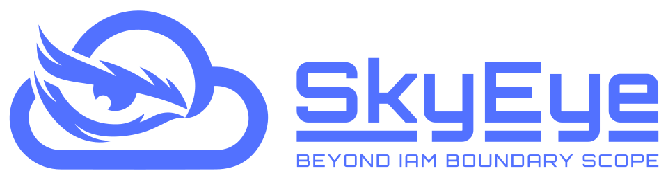
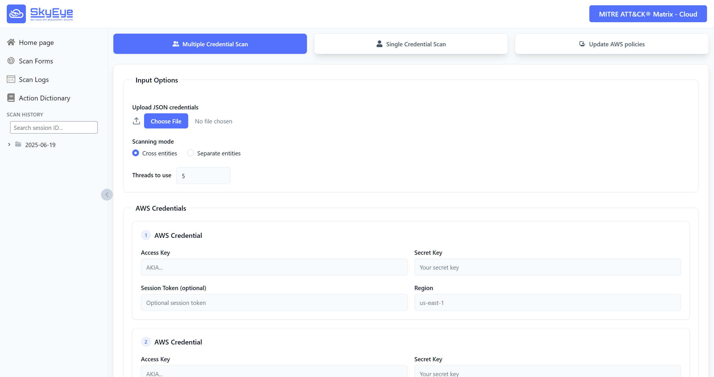
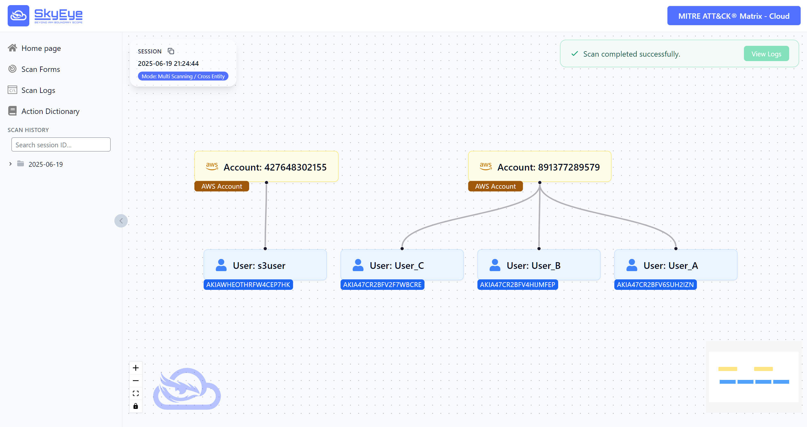
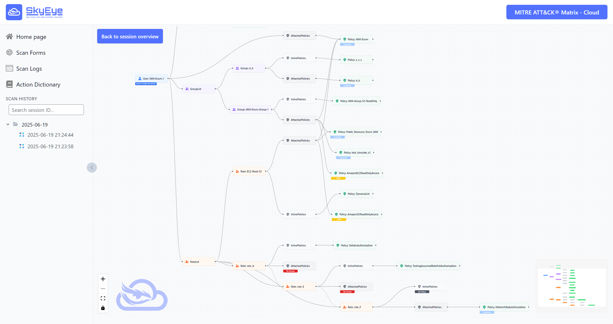
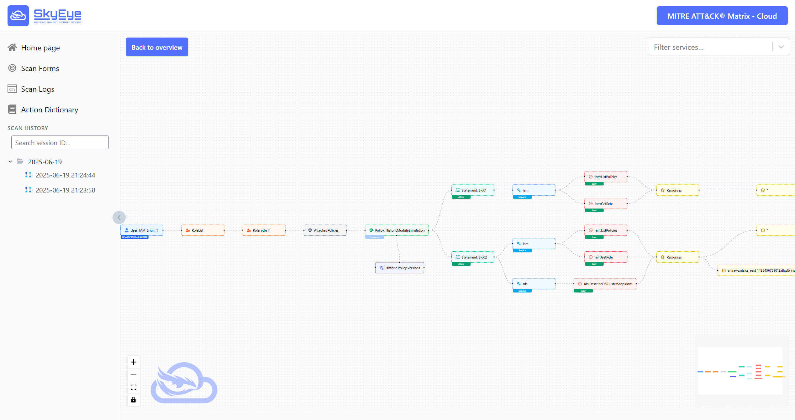

<a name="readme-top"></a>

<div align="center">
  
  <h1 align="center">SkyEye: When Your Vision Reaches Beyond IAM Boundary Scope </h1>
  <p><strong>The First Cooperative Multi-Principal IAM Enumeration Framework for AWS Cloud</strong></p>
</div>

<div align="center">
  <a href="https://doi.org/10.5281/zenodo.15739726"></a>
  <a href="https://github.com/0x7a6b4c/SkyEye"></a>
  <a href="https://skyeye.gitbook.io/docs"></a>
  <hr>
</div>


Welcome to **SkyEye**! SkyEye is a cutting-edge cooperative multi-principal IAM enumeration framework designed specifically for the cloud environment with current support for AWS cloud.

**SkyEye** is developed with the ultimate goal of re-inventing prior-art IAM enumeration models from the black-box approach, aiming to efficiently minimize false negatives and enhance overall accuracy in discovery.

<span id='features'/>

## ✨Key Features

* 🏆 **Cross-Principal IAM Enumeration Model (CPIEM)**
</br>SkyEye equipped with CPIEM, introducing a new concept of cooperative IAM enumeration between multiple principals, re-inventing the approach in enumerating authorization of user principals in AWS. It will correlate simultaneously the sessions of multiple valid AWS credentials to continually expose the complete IAM visibility of each user principal.

* 📚 **Supplement IAM Enumeration Mode**
</br> Apart from the core enumeration models of SkyEye framework, SkyEye integrated the separate-principal and single-principal IAM enumeration mode to demonstrate how CPIEM differs from those.
    * **Separate-Principal IAM Enumeration**: Multiple-principal IAM enumeration, but without cooperative multi-principal IAM enumeration capability.
    * **Single-Principal IAM Enumeration**: Only supports single valid AWS credentials. Fuzzing and permissions simulation capability are integrated in this mode only, to avoid a huge amount of time due to a large number of AWS actions.
        * Integrating with Permissions Simulation Capability for User Principal and In-Scope IAM Roles
        * Integrating with Fuzzing Capability

* 📚 **Transitive Cross-Role Enumeration Model (TCREM)**
</br>SkyEye equipped with the TCREM, introducing a new methodology in collaborating role's temporary sessions in improving the overall accuracy of IAM vision discovery. TCREM has been seamlessly integrated into all enumeration modes of SkyEye framework.

* ✨ **IAM Deep Enumeration Capabilities**
</br> SkyEye supports a comprehensive enumeration capabilities of IAM entities relevant to user principals involved in the enumeration session. These capabilities have been seamlessly integrated into all enumeration modes of SkyEye framework:
    * Retrieval of In-Scope IAM Groups and In-Scope IAM Roles for User Principals
    * Retrieval of Inline Policies for User Principals
    * Retrieval of Inline Policies for In-Scope IAM Groups
    * Retrieval of Inline Policies for In-Scope IAM Roles
    * Retrieval of Attached Managed Policies for User Principals
    * Retrieval of Attached Managed Policies for In-Scope IAM Groups
    * Retrieval of Attached Managed Policies for In-Scope IAM Roles
    * Versions Fuzzing Algorithm to identify Available Policy Versions
    * Alternative Comprehensive Enumeration by `iam:GetAccountAuthorizationDetails`
    * Inverse Enumeration Approach for Attached Managed Policy by `iam:ListEntitiesForPolicy`

* ⚖️ **Deep Comparison Model for Policy Documents of Active Version and Historical Versions**
</br>SkyEye automatically discovers and retrieves the policy documents between current active version of customer-managed policy, and utilize its deep comparsion model to differentiate the changes between the current version with historical versions. 

* 🔀 **The Mapping with MITRE ATT&CK Matrix - Cloud**
</br>SkyEye presents the dataset of mapping nearly ~20,000 AWS actions to MITRE ATT&CK tactics, techniques, and sub-techniques, with detail description about abuse methodology by threat actors, and the sample AWS CLI commands.

* 📊 **The Integration of Severity-level Classification**
</br>SkyEye provides the integration of severity-level classification for ~20,000 AWS actions, ranging from `Low`, `Medium`, `High`, and `Critical`, to those specifically denoted as `PrivEsc-Vector`, represents a pivotal advancement in threat exposure.

* 📇 **Logs & Portable Output**
</br>Real‑time server‑sent logs to understand what SkyEye is doing. The Output format as the JSON files that can be archived or integrated into other platforms.

🚀 Unlock the Future of Cooperative Multi-Principal IAM Enumeration in Cloud. Try 🔥SkyEye🔥 Now!

[](https://youtu.be/rMJFZGR3CyI)

<span id='news'/>

## 🔥 News

<div class="scrollable">
    <ul>
      <li><strong>[2025, 26 June]</strong>: &nbsp;🎉🎉We've released <b>SkyEye!</b>, including framework, proposed models, CLI and platform! Check our <a href="https://doi.org/10.5281/zenodo.15739726">paper</a> for more details.</li>
    </ul>
</div>

<span id='table-of-contents'/>

## 📑 Table of Contents

* <a href='#features'>✨ Features</a>
* <a href='#news'>🔥 News</a>
* <a href='#skyeye-discussion'>☁ The Discussion of SkyEye Framework</a>
* <a href='#how-to-use'>🔍 How to Use SkyEye</a>
  * <a href='#skyeye-platform'>1. `SkyEye Platform`</a>
  * <a href='#skyeye-cli'>2. `SkyEye CLI`</a>
* <a href='#quick-start'>⚡ Quick Start</a>
  * <a href='#pre-installation'>⚙️ A. Pre-installed Requirements</a>
  * <a href='#installation'>⏳ B. Installation</a>
  * <a href='#quick-tutorial'>🖥️ C. SkyEye Quick Tutorial</a>
* <a href='#api-reference'>📑 API Reference (FastAPI)</a>
* <a href='#reproduce'>🔬 How To Reproduce the Results in the Paper</a>
* <a href='#documentation'>📖 Documentation</a>
* <a href='#cite'>🌟 Cite</a>
* <a href='#license'>📄 License</a>

<span id='skyeye-discussion'/>

## ☁ The Discussion of SkyEye Framework

The original idea of the SkyEye came from the difficulty that occurs with the single-principal IAM enumeration approach. In the enumeration phase of the penetration testing process, penetration testers often gather multiple AWS credentials in the format: AccessKey, SecretKey, Session Token. However, it could only perform separate-principal or single-principal IAM enumeration from each user session, leading to false negatives due to limitation of principal-specific IAM entitlement vision. To resolve this limitation, the `Cross-Principal IAM Enumeration Model (CPIEM)` was proposed and developed to efficiently perform advanced IAM enumeration across multiple user principals within the AWS Account Id, to complement each user's IAM vision context. By coordinating available sessions of each valid credential simultaneously, it can:
* Discover hidden permissions
* Reveal a more accurate and complete IAM policy landscape for each IAM entity
* Minimize false negatives that typically occur with single-principal IAM enumeration

Instead of depending on the self-access IAM entitlement visibility of single user to reveal its IAM context, and to fully understand what permissions and what resources that the user is allowed to perform and interact with, sometimes leading to false negatives when user could perform some specific permissions to specific resources but could not have the situational awareness on that, the cross-principal IAM enumeration model, which is the core capability of SkyEye framework, is designed to tackle this limitation by involving and correlating simultaneously multiple valid credentials to continually expose the complete IAM visibility of each user principal.

Last but not least, one of core model which differs SkyEye from other prior-art models and frameworks is `Transitive Cross-Role Enumeration Model (TCREM)`.

Each "user" principal might have the permission to assume some specific roles and retrieve the temporary session tokens to act on behalf of those roles. Each "role" principal might also have the permission to assume the other roles, and to act on behalf of those roles through temporary session tokens.

The term In-scope IAM Roles in `Transitive Cross-Role Enumeration Model (TCREM)` is defined by:
* The roles that can be assumed **directly** by provided AWS credentials:
    * User A → Role A
    * User A → Role B
* The roles that can be assumed **indirectly** by the roles that can be assumed by provided AWS credentials:
    * User A → Role A
        * Role A → Role E
            * Role E → Role F
                * Role F → Role I
        * Role A → Role G
            * Role G → Role H
    * User A → Role B

> **In-Scope IAM Roles: Role A, Role B, Role E, Role F, Role I, Role G, Role H**

`Transitive Cross-Role Enumeration Model (TCREM)` is proposed and developed with the capability of gathering in-scope IAM roles, performing the transitive role assumption to act on behalf of in-scope IAM roles, and simultaneously complementing to the entire scanning output, subsequently contributing to the reduction of false negatives, and improving the overall accuracy of the IAMs output. Each role is an independent principal with associated permissions assigned to, which can be leveraged in complementing to the overall enumeration of IAM users, groups, roles, policies that having a strong bond to the targeting AWS credentials. Currently, TCREM has been integrated into the 3 main enumeration mode of SkyEye: Cross-Principal, Separate-Principal, Single-Principal.

---

<span id='how-to-use'/>

## 🖼️ How to Use SkyEye

<span id='skyeye-platform'/>

### 1. `SkyEye Platform`

<table>
<tr align="center">
    <td width="33%">
        
        <br>
        <em>SkyEye - Multiple-User Scanning Form</em>
    </td>
    <td width="33%">
        
        <br>
        <em></br>SkyEye</br>Update Form</em>
    </td>
    <td width="33%">
        
        <br>
        <em>SkyEye - Single-User Scanning Form</em>
    </td>
</tr>
</table>
<table>
<tr align="center">
    <td width="33%">
        
        <br>
        <em>SkyEye - Logs History of Scanning Session</em>
    </td>
    <td width="33%">
        
        <br>
        <em></br>SkyEye</br>Logs Dashboard</em>
    </td>
    <td width="33%">
        
        <br>
        <em>SkyEye - Session Scanning Progress Bar</em>
    </td>
</tr>
</table>
<table>
<tr align="center">
    <td width="33%">
        
        <br>
        <em>SkyEye Output - Scanning Session Dashboard</em>
    </td>
    <td width="33%">
        
        <br>
        <em>SkyEye Output - User-specific IAM Diagram</em>
    </td>
    <td width="33%">
        
        <br>
        <em>SkyEye Output - Example AttachedManagedPolicies</em>
    </td>
</tr>
</table>
<table>
<tr align="center">
    <td width="33%">
        
        <br>
        <em>SkyEye Output - Example InlinePolicies</em>
    </td>
    <td width="33%">
        
        <br>
        <em>SkyEye Output - Deep Comparison - Policy Versions</em>
    </td>
    <td width="33%">
        
        <br>
        <em>AWS Actions - MITRE ATT&CK, Risk Level, Abuse Methodology, Commands</em>
    </td>
</tr>
</table>
<table>
<tr align="center">
    <td width="50%">
        
        <br>
        <em>MITRE ATT&CK Matrix Table - Cloud</em>
    </td>
    <td width="50%">
        
        <br>
        <em>AWS Actions Mapping - SkyEye Dataset</em>
    </td>
</tr>
</table>

<span id='skyeye-cli'/>

### 3. `SkyEye CLI`

<table>
<tr align="center">
    <td width="50%">
        
        <br>
        <em>SkyEye CLI</br>The Display of Help Function</em>
    </td>
    <td width="50%">
        
        <br>
        <em>SkyEye CLI</br>The Example of SkyEye Running</em>
    </td>
</tr>
</table>

<span id='quick-start'/>

## ⚡ Quick Start

<span id='pre-installation'/>

### ⚙️ A. Pre-installed Requirements

#### 🐍 Python
It is recommended to install Python 3.11 or above
```bash
sudo apt update
sudo apt install -y python3.11 python3.11-venv python3.11-dev
sudo update-alternatives --install /usr/bin/python python /usr/bin/python3.11 1
sudo update-alternatives --config python
```

#### 💠 Node.JS
It is recommended to install Node.JS - Version 20:
```bash
curl -o- https://raw.githubusercontent.com/nvm-sh/nvm/v0.39.5/install.sh | bash
export NVM_DIR="$HOME/.nvm"
source "$NVM_DIR/nvm.sh"
nvm install 20
npm install
npm run build
```

<span id='installation'/>

### ⏳ B. Installation

#### 🖥️ 1. SkyEye Command Line (CLI-based)

```bash
# 1. Clone the repo
$ git clone https://github.com/0x7a6b4c/skyeye.git && cd skyeye

# 2. Install requirements
$ pip install -r requirements.txt

# 3. IAM Enumeration mode
# 3.1 Multiple Users - Cross-Principal mode
$ python skyeye.py --json-file credentials.json --mode cross-entity --thread THREAD_NUMBER

# 3.2 Multiple Users - Separate-Principal mode
$ python skyeye.py --json-file credentials.json --mode separate-entity --thread THREAD_NUMBER

# 3.3 Single-Principal mode
$ python skyeye.py --access-key ACCESS_KEY --secret-key SECRET_KEY --session-token OPTIONAL_SESSION_TOKEN --region REGION --thread THREAD_NUMBER

# 4. Update libraries
# 4.1 MITRE ATT&CK only
$ python skyeye.py --update --mitre-attack-cloud

# 4.2 AWS Actions only
$ python skyeye.py --update --aws-actions 

# 4.3 AWS-Managed Policies only
$ python skyeye.py --update --aws-managed-policies

# 4.4 A Complete Update
$ python skyeye.py --update --mitre-attack-cloud --aws-actions --aws-managed-policies
```

#### 📦 2. SkyEye Platform (WebApp) - Docker Container
We also support Docker to containerize the entire SkyEye environment. Install [Docker](https://www.docker.com/) first to faciliate the installation process.

```bash
# 1. Clone the repo
$ git clone https://github.com/0x7a6b4c/skyeye.git && cd skyeye

# 2. Build and run both services
$ docker‑compose up --build

# 3. Open the app
Frontend  → http://localhost:3000
Backend UI → http://localhost:8000/docs
```

Behind the scenes Compose spins up two containers:

| Container           | Port  | Purpose                      |
| ------------------- | ----- | ---------------------------- |
| **skyeye‑backend**  |  8000 | FastAPI API (scan engine)    |
| **skyeye‑frontend** |  3000 | Next.js UI (tree visualiser) |

Environment variable `NEXT_PUBLIC_API_BASE_URL` (already set in _docker‑compose.yml_) tells the frontend where to find the API.

##### ⚙️ Configuration

| Variable                   | Default                 | Description                                     |
| -------------------------- | ----------------------- | ----------------------------------------------- |
| `THREADS`                  |  `20`                   | Number of parallel AWS SDK calls per credential |
| `NEXT_PUBLIC_API_BASE_URL` | `http://localhost:8000` | Frontend → Backend URL                          |

All config can be set via `.env` or the container `environment:` block.

#### 🛠️ 3. SkyEye Platform (WebApp) - Automatic Run Scripts

```bash
$ git clone https://github.com/0x7a6b4c/skyeye.git && cd skyeye
$ chmod +x ./gui_run.sh
$ ./gui_run.sh
# Frontend  → http://localhost:3000
# Backend UI → http://localhost:8000/docs
```

```powershell
$ git clone "https://github.com/0x7a6b4c/skyeye.git" && cd skyeye
$ .\gui_run.ps1
# Frontend  → http://localhost:3000
# Backend UI → http://localhost:8000/docs
```

| Container           | Port  | Purpose                      |
| ------------------- | ----- | ---------------------------- |
| **skyeye‑backend**  |  8000 | FastAPI API (scan engine)    |
| **skyeye‑frontend** |  3000 | Next.js UI (tree visualiser) |

<span id='quick-tutorial'/>

### 🖥️ C. SkyEye Quick Tutorial

1. Provide Access-Key + Secret-Key + (Optional) Session Token + Region for AWS credentials in the scan form, or upload JSON credential file storing AWS credentials.
2. Click **Start Scan** → watch progress & live logs.
3. Once completed the visual tree appears - expand nodes to investigate your IAM context.

<span id='api-reference'/>

## 📑 API Reference (FastAPI)

| Method   | Path                                               | Purpose / Notes                                                                                                                                   |
| -------- | -------------------------------------------------- | ------------------------------------------------------------------------------------------------------------------------------------------------- |
| **POST** | `/scan`                                            | Start a new scan.<br>**Body**:<br>`{ credentials: [ … ], mode: "cross‑entity" \| "separate‑entity", thread: int, fuzz: bool }` → `{ session_id }` |
| **GET**  | `/sessions`                                        | Return a folder‑style tree (dates → sessions) used by the history sidebar.                                                                        |
| **GET**  | `/sessions/{session_id}`                           | JSON summary of accounts → credentials for a scan.                                                                                                |
| **GET**  | `/sessions/{session_id}/status`                    | `running` \| `fuzzing` \| `completed` \| `failed`.                                                                                                |
| **GET**  | `/sessions/{session_id}/logs`                      | **Server‑Sent Events** stream of live scan logs.                                                                                                  |
| **GET**  | `/sessions/{session_id}/{account_id}/{access_key}` | Raw JSON for a single credential set.<br>Optional query `mode=scan` or `mode=fuzz`.                                                               |
| **POST** | `/update`                                          | Kick off a data update (MITRE ATT\&CK Cloud, AWS actions, and AWS-managed policies).<br>**Body**:<br>`{ types: ["mitre-attack-cloud", "aws-actions", "aws-managed-policies"], thread: int }` → `{ update_id }` |
| **GET**  | `/update/{update_id}/status`                       | `running` \| `completed` \| `failed`.                                                                                                             |
| **GET**  | `/update/{update_id}/logs`                         | **Server‑Sent Events** stream of update job logs.                                                                                                 |

Open **`/docs`** (Swagger UI) or **`/redoc`** for interactive documentation generated automatically by FastAPI.

<span id='reproduce'/>

## 🔬 How To Reproduce the Results in the Paper

### Scenario-based Benchmark
For the Scenario-based benchmark, you can run the following command to generate the credentials based on the scenarios you wanted. we have created 22 based scenarios for user to test out. 

However, you would need to perform aws cli configure on your own account with relevant permissions together with having terraform installed on your workstation

```bash
aws cli config

# initialize terraform
terraform init

# Apply terraform
terrafrom apply -auto-approve -input=false -var-file="tf-skyeye/scenarios/<scenario_numer>.tfvars"
# Please run terraform output to create a json format of the created users from the given scenario
terraform output -json user_credentials > credentials.json

# Destsroy terraform after use
terraform destroy -auto-approve
```

<span id='documentation'/>

## 📖 Documentation

A more detailed documentation is now available at the [Documentation](https://skyeye.gitbook.io/docs) page.

## Misc
Your star is a signficant contribution to croissant in our breakfast 🚀

<div align="center">

[](https://github.com/0x7a6b4c/SkyEye/stargazers)

[](https://github.com/0x7a6b4c/SkyEye/network/members)

[](https://star-history.com/#0x7a6b4c/SkyEye&Date)

</div>

<span id='cite'/>

## 🌟 Cite

```tex
@misc{SkyEye,
      title={{SkyEye: When Your Vision Reaches Beyond IAM Boundary Scope in AWS Cloud}},
      author={Minh Hoang Nguyen, Anh Minh Ho, Bao Son To},
      year={2025},
      eprint={15739726},
      archivePrefix={Zenodo},
      url={https://doi.org/10.5281/zenodo.15739726},
}
```

<span id='license'/>

## 📄 License

SkyEye is released under the **AGPL-3.0 license**. See `LICENSE` for details.
